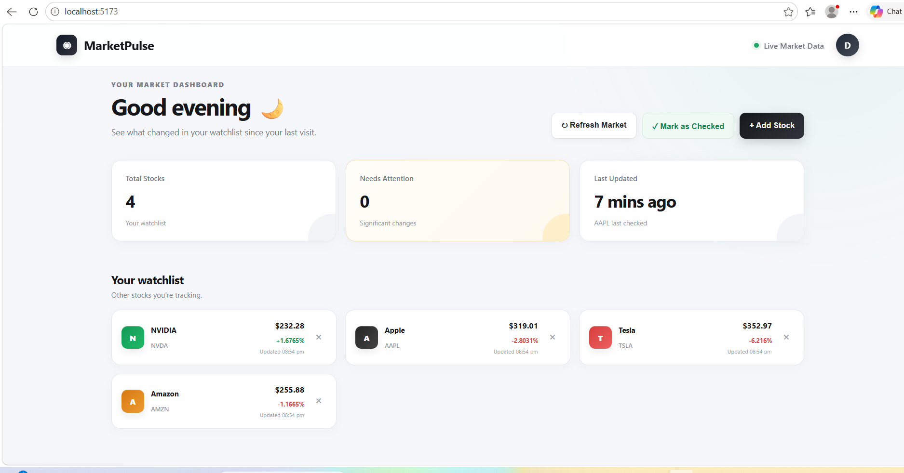

# 📈 MarketPulse

A stock tracking dashboard that helps users monitor their watchlist, view real-time market prices, and identify meaningful stock price changes since their last check.

MarketPulse combines a **React frontend**, **Node.js/Express backend**, **MongoDB database**, and **Finnhub market data API** to provide a simple and responsive market monitoring experience.

---

## ✨ Features

* 📊 Real-time stock market data using Finnhub API
* ⭐ Personal stock watchlist
* ➕ Add stocks to watchlist
* ❌ Remove stocks from watchlist
* 🔄 Refresh latest market prices
* 📌 Mark stocks as checked
* 📈 Track previous stock prices
* 🚨 Detect meaningful price changes
* 👀 "Needs Attention" section for significant movements
* 🕒 Display last checked time
* 🟢 Show market data update time
* ⚠️ Handle unavailable or stale market data
* 💾 Persistent watchlist storage using MongoDB
* 🎨 Clean and responsive dashboard UI
* 📱 Responsive layout for different screen sizes

---

## 🛠️ Tech Stack

### Frontend

* React
* JavaScript
* CSS
* Vite

### Backend

* Node.js
* Express.js
* REST API

### Database

* MongoDB
* Mongoose

### Market Data

* Finnhub API

---

## 📂 Project Structure

```text
MarketPulse/
│
├── backend/
│   ├── models/
│   │   └── Watchlist.js
│   │
│   ├── server.js
│   ├── package.json
│   └── .env
│
├── frontend/
│   ├── src/
│   │   ├── App.jsx
│   │   ├── App.css
│   │   └── main.jsx
│   │
│   ├── package.json
│   └── ...
│
├── .gitignore
└── README.md
```

---
---

## 🎨 Dashboard

MarketPulse provides a clean and responsive dashboard designed for quick stock monitoring.

The dashboard includes:

* 👋 Time-based greeting
* 📊 Watchlist summary
* 🚨 Needs Attention section
* 🔄 Refresh Market action
* ✅ Mark as Checked action
* 🔎 Stock search and add functionality
* 📈 Current price and percentage change
* 🕒 Market update timestamps
* ⚠️ Market data availability warnings

The interface is designed to make important stock movements easy to identify at a glance.
## 📸 Dashboard Preview



## 🔄 How MarketPulse Works

```text
User
  │
  ▼
React Frontend
  │
  ▼
Express REST API
  │
  ├──────────────► MongoDB
  │
  └──────────────► Finnhub API
                       │
                       ▼
                 Latest Market Data
                       │
                       ▼
                 React Dashboard
```

---

## 📊 Stock Tracking Logic

MarketPulse stores the current stock price along with the user's last checked price.

When the user selects **Mark as Checked**, the current price is saved as the previous snapshot.

For example:

```text
Previous Price = $220.00
Current Price  = $228.45
```

The application calculates:

```text
Price Difference = Current Price - Previous Price
```

and:

```text
Price Change % =
((Current Price - Previous Price) / Previous Price) × 100
```

A stock is considered to have a **meaningful change** when the absolute price change is **3% or greater**.

```text
|Price Change %| >= 3%
        │
        ├── Yes → Needs Attention
        │
        └── No  → Stable
```

---

## 🚨 Needs Attention

The dashboard automatically identifies stocks that have changed significantly since the user's last check.

For example:

```text
NVDA

Previous Price: $220.00
Current Price:  $228.45

Change: +3.84%

Status: Needs Attention
```

This helps users quickly identify stocks that may require attention instead of manually comparing prices.

---

## 🔄 Market Refresh

The **Refresh Market** button requests the latest market data from Finnhub.

The backend updates:

* Current price
* Percentage change
* Market update timestamp

The previous snapshot is **not overwritten** during a market refresh.

This allows MarketPulse to compare:

```text
Last Checked Price
        vs
Latest Market Price
```

---

## 📌 Mark as Checked

The **Mark as Checked** button saves the current market state as the user's latest reference point.

It stores:

* `previousPrice`
* `previousChange`
* `lastCheckedAt`

After marking stocks as checked, the dashboard can determine whether the stock has meaningfully changed during the next visit.

---

## 🕒 Market Data Timestamp

MarketPulse tracks when market data was last successfully updated.

The dashboard can display information such as:

```text
Updated 07:40 PM
```

This helps users understand how recent the displayed market data is.

---

## ⚠️ Error Handling

MarketPulse handles market-data failures without crashing the application.

If the Finnhub service is unavailable:

* The application keeps the last known stock data.
* The user receives a warning message.
* Other available stock data remains visible.

Example:

```text
⚠ Unable to update some market data.
Showing your last known data.
```

The application also tracks whether market data is stale.

---

## 🔌 API Endpoints

### Health Check

```http
GET /
```

Returns:

```json
{
  "message": "MarketPulse API is running 🚀"
}
```

---

### Backend Health

```http
GET /api/health
```

---

### Get Watchlist

```http
GET /api/watchlist
```

Returns all stocks saved in the watchlist.

---

### Add Stock

```http
POST /api/watchlist
```

Adds a stock to the MongoDB watchlist.

---

### Remove Stock

```http
DELETE /api/watchlist/:symbol
```

Removes a stock from the watchlist.

Example:

```http
DELETE /api/watchlist/NVDA
```

---

### Save Last Check

```http
POST /api/watchlist/:symbol/check
```

Saves the current stock price as the user's previous snapshot.

Example:

```http
POST /api/watchlist/NVDA/check
```

---

### Analyze Stock

```http
GET /api/watchlist/:symbol/analysis
```

Checks whether the stock has changed meaningfully since the last check.

Example:

```http
GET /api/watchlist/NVDA/analysis
```

---

### Refresh Market Data

```http
POST /api/watchlist/:symbol/refresh
```

Fetches the latest market data from Finnhub.

Example:

```http
POST /api/watchlist/NVDA/refresh
```

---

### Test Market API

```http
GET /api/market/:symbol
```

Fetches market data directly from Finnhub through the backend.

Example:

```http
GET /api/market/NVDA
```

---

## 🗄️ MongoDB Data Model

Each watchlist stock contains information such as:

```text
symbol
name
exchange
price
change
previousPrice
previousChange
lastCheckedAt
marketUpdatedAt
marketDataStale
logo
logoClass
createdAt
updatedAt
```

The previous price fields allow the application to compare the current market price with the user's last checked snapshot.

---

## 🔐 Environment Variables

Create a `.env` file inside the `backend` folder.

Example:

```env
MONGODB_URI=your_mongodb_connection_string
FINNHUB_API_KEY=your_finnhub_api_key
PORT=5000
```

### Important

Never commit your real `.env` file or API keys to GitHub.

Make sure `.env` is included in `.gitignore`.

---

## 🚀 Getting Started

### 1. Clone the repository

```bash
git clone https://github.com/divyarani9191/MarketPulse.git
```

```bash
cd MarketPulse
```

---

### 2. Install backend dependencies

```bash
cd backend
npm install
```

---

### 3. Configure environment variables

Create:

```text
backend/.env
```

Add:

```env
MONGODB_URI=your_mongodb_connection_string
FINNHUB_API_KEY=your_finnhub_api_key
PORT=5000
```

---

### 4. Start the backend

From the `backend` directory:

```bash
node server.js
```

You should see:

```text
✅ MongoDB connected successfully
🚀 MarketPulse backend running on http://localhost:5000
```

---

### 5. Start the frontend

Open another terminal:

```bash
cd frontend
npm install
npm run dev
```

Then open the local URL provided by Vite.

---

## 🧪 Example API Testing

Check the backend:

```bash
curl http://localhost:5000/api/health
```

Check market data:

```bash
curl http://localhost:5000/api/market/NVDA
```

Refresh a stock:

```bash
curl -X POST http://localhost:5000/api/watchlist/NVDA/refresh
```

Mark stock as checked:

```bash
curl -X POST http://localhost:5000/api/watchlist/NVDA/check
```

Analyze stock:

```bash
curl http://localhost:5000/api/watchlist/NVDA/analysis
```

---

## 🎯 Project Goal

The goal of MarketPulse is to make stock monitoring simpler by combining live market data with personalized watchlist tracking.

Instead of only showing the current stock price, MarketPulse answers an important question:

> **"What changed since I last checked?"**

---

## 🔮 Future Improvements

Possible future enhancements include:

* 📉 Interactive stock price charts
* 📰 Financial news integration
* 🤖 AI-powered stock summaries
* 📱 Mobile responsive improvements
* 🔔 Price-change notifications
* 👤 User authentication
* 📊 Historical price tracking
* 🌎 Support for additional markets
* ☁️ Cloud deployment
* 📈 More advanced technical indicators

---

## ⚠️ Disclaimer

MarketPulse is an educational software project for monitoring market data.

It does not provide financial advice, investment recommendations, or guarantees about future stock performance.

---

## 👩‍💻 Author

**Divya Rani**

GitHub:
https://github.com/divyarani9191

Project:
https://github.com/divyarani9191/MarketPulse
